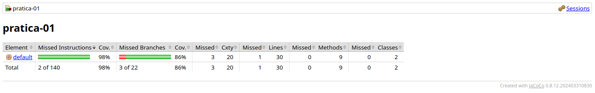

# Relatório

## Testes Baseados em Especificação

### Levantamento dos Requisitos (Understand the Specification)

**Entradas (Inputs):**

- **Ponto A e Ponto B:** coordenadas geográficas $(x, y)$ ou objetos contendo a localização das observações.
- **Espécie A e Espécie B:** strings ou identificadores taxonômicos.
- **Status de Invasora:** valor booleano para cada espécie (Sim/Não).
- **Saúde A e Saúde B:** valores numéricos, por exemplo em uma escala de 0 a 100.
- **Configurações do Pesquisador:**
- Limite de Distância ($L$): valor numérico.
- Patamar de Saúde: valor numérico mínimo.
- Modo de Análise Ecológica: valor booleano (ativo/inativo).
- Limite Operacional: capacidade máxima de registros de saída.

**Saídas (Outputs):**

- **Conexão formada:** indicação de que o núcleo de biodiversidade foi reconhecido para o par analisado.
- **Interrupção de processamento:** indicação de que o processamento deve ser interrompido quando o limite operacional for excedido.

**Caso Feliz (Happy Path):**

- Pontos com distância $d = 5$ e limite $L = 10$.
- Espécies iguais, por exemplo, "Panthera onca".
- Saúde dos dois indivíduos igual a 80, com patamar exigido igual a 60.
- Nenhuma das espécies é invasora.
- Volume de dados abaixo do limite operacional.

**Resultado Esperado:** o sistema confirma a formação do núcleo de biodiversidade e registra a conexão.

**Regra de Ouro:** Dois pontos formam um núcleo se:

- A distância euclidiana $d \leq L$.
- As espécies são iguais **OU** o Modo de Análise Ecológica está ativo.
- A saúde dos espécimes $\geq$ Patamar do Ambiente.
- Não há duas espécies invasoras simultâneas.
- O volume de saída está dentro do limite operacional.

### 2. Identificação das Partições (Identify the Partitions)

#### Classes de Equivalência

**Partição Distância ($d$):**

- $P_1: \{d \leq L\}$ (Válida)
- $P_2: \{d > L\}$ (Inválida)

**Partição Identidade:**

- $P_3: \{\text{Espécie A} = \text{Espécie B}\}$ (Válida)
- $P_4: \{\text{Espécie A} \neq \text{Espécie B} \text{ AND Modo Amplo OFF}\}$ (Inválida)
- $P_5: \{\text{Espécie A} \neq \text{Espécie B} \text{ AND Modo Amplo ON}\}$ (Válida)

**Partição Saúde:**

- $P_6: \{\text{Saúde}_{O_1} \geq \text{Patamar} \text{ AND } \text{Saúde}_{O_2} \geq \text{Patamar}\}$ (Válida)
- $P_7: \{\text{Saúde}_{O_1} < \text{Patamar} \text{ OR } \text{Saúde}_{O_2} < \text{Patamar}\}$ (Inválida)

**Partição Segurança (Invasoras):**

- $P_8: \{0 \text{ ou } 1 \text{ Invasora}\}$ (Válida)
- $P_9: \{2 \text{ Invasoras}\}$ (Inválida)

**Partição Volume de Saída (Limite Operacional):**

- $P_{10}: \{|\text{conexões}| \leq \text{Limite}\}$ (Válida — processamento continua)
- $P_{11}: \{|\text{conexões}| > \text{Limite}\}$ (Inválida — processamento interrompido)

#### Seleção de Subconjuntos (Partições de Equivalência)

**Subconjunto A: Critério Espacial e Taxonômico**

Este grupo testa a lógica básica de conexão e a influência do modo de análise.

- **Conexão Direta:** distância dentro do limite + mesma espécie.
- **Análise Ecológica Ampla:** distância dentro do limite + espécies diferentes + modo amplo ativo.
- **Bloqueio Taxonômico:** distância dentro do limite + espécies diferentes + modo amplo inativo.
- **Fora de Alcance:** distância acima do limite, independentemente dos demais fatores.

**Subconjunto B: Filtros de Qualidade e Biológicos**

Este grupo foca nas restrições de saúde e na segurança contra espécies invasoras.

- **Filtro de Saúde:** distância e identidade taxonômica adequadas, mas pelo menos um indivíduo com saúde abaixo do patamar. Resultado esperado: não conecta.
- **Segurança Invasora (Individual):** uma espécie é invasora e a outra não. Resultado esperado: pode conectar, desde que as demais regras sejam satisfeitas.
- **Segurança Invasora (Mútua):** ambas as espécies são invasoras. Resultado esperado: bloqueio da formação do núcleo por segurança biológica.

**Subconjunto C: Limites Operacionais e Exceções**

Este grupo testa a robustez do sistema em relação ao volume de dados gerado.

- **Capacidade Nominal:** processamento com carga próxima ao limite máximo, sem excedê-lo.
- **Estouro de Segurança:** entrada de dados que força uma saída maior que o limite operacional. Resultado esperado: interrupção segura do processamento.

#### 4. Resumo da Estratégia de Corretude

| Subconjunto | Entrada Chave | Comportamento Esperado |
|-------------|---------------|------------------------|
| Limites (In-point) | $d = L$ | Conexão bem-sucedida, desde que as demais condições também sejam satisfeitas. |
| Limites (Out-point) | $d = L + 0.1$ | Conexão rejeitada. |
| Saúde (Off-point) | $\text{Saúde} = \text{Patamar} - 1$ para pelo menos um dos espécimes | Filtro de qualidade ativado, sem formação de conexão. |
| Conflito Invasora | $\text{Invasora A} = \text{True}$, $\text{Invasora B} = \text{True}$ | Formação do núcleo bloqueada por segurança biológica. |

### 3. Identificação dos Valores Limite (Identify Boundary Values)

Focamos nos pontos exatos onde o comportamento muda (In-points, Out-points, Off-points).

**Distância ($L$):** Testar com $d = L$ (no limite), $d = L - 0.1$ (dentro) e $d = L + 0.1$ (fora).

**Saúde ($\text{Patamar}$):** Testar com saúde exatamente igual ao patamar e saúde $\text{Patamar} - 0.01$.

**Limite de Dados:** Testar com o número máximo de registros permitido e com $\text{Máximo} + 1$ (deve interromper).

#### In-points e Out-points Identificados

Os pontos de entrada e saída da fronteira foram identificados a partir dos requisitos já levantados.

**Distância:**

- **In-point:** $d = L$.
- **Out-point:** $d = L + 0.1$.

**Saúde:**

- **In-point:** $\text{Saúde}_{O_1} = \text{Patamar}$ e $\text{Saúde}_{O_2} = \text{Patamar}$.
- **Out-point:** $\text{Saúde}_{O_1} = \text{Patamar} - 0.01$ ou $\text{Saúde}_{O_2} = \text{Patamar} - 0.01$.

**Limite Operacional:**

- **In-point:** $|\text{conexões}| = \text{Limite}$.
- **Out-point:** $|\text{conexões}| = \text{Limite} + 1$.

#### Validação dos Valores Limite

| Elemento | Valores Limite | Validação |
|----------|----------------|-----------|
| Distância | $d = L$, $d = L - 0.1$, $d = L + 0.1$ | Correto. O requisito é $d \leq L$, então o ponto de fronteira está em $L$: um valor exatamente igual ainda é válido, um pouco abaixo permanece válido e um pouco acima torna-se inválido. |
| Saúde | $\text{Saúde} = \text{Patamar}$ e $\text{Saúde} = \text{Patamar} - 0.01$ | Parcialmente correto. Esses dois valores cobrem a fronteira numérica, mas como o requisito envolve ambos os espécimes, o ideal é aplicar essa análise a $O_1$ e $O_2$, verificando também o caso em que apenas um deles fica abaixo do patamar. |
| Limite de Dados | $\text{Máximo}$ e $\text{Máximo} + 1$ | Correto. Pelo enunciado, o processamento deve ser interrompido quando o volume de saída exceder o limite, portanto o valor máximo ainda é válido e somente $\text{Máximo} + 1$ deve provocar interrupção. |

Com base nos requisitos anteriores, os valores limite de distância e do limite operacional estão corretos. Para saúde, a fronteira numérica está correta, mas a validação deve considerar separadamente cada um dos dois espécimes envolvidos na conexão.

### 4. Derivação de Casos de Teste (Pragmática)

#### 1. Cenários de Sucesso (Happy Path e Variações)

Estes testes garantem que as funcionalidades principais operam conforme o esperado.

**CT01: Conexão Padrão (In-point de Distância)**

- **Entrada:** distância $d = L$, mesma espécie, saúde acima do patamar para ambos os indivíduos, espécies não invasoras.
- **Resultado Esperado:** conexão estabelecida com sucesso.

**CT02: Modo Ecológico Amplo (Variação de Taxonomia)**

- **Entrada:** distância $d < L$, espécies diferentes, modo amplo ativo, saúde acima do patamar.
- **Resultado Esperado:** conexão estabelecida pela regra de diversidade ativa.

#### 2. Testes de Fronteira (Boundary Testing)

Focamos nos pontos em que o comportamento do software muda.

**CT03: Limite de Distância (Out-point)**

- **Entrada:** distância $d = L + 0.1$, mesma espécie, saúde adequada.
- **Resultado Esperado:** conexão rejeitada por estar fora do raio permitido.

**CT04: Limite de Saúde (In-point)**

- **Entrada:** saúde de ambos os espécimes exatamente igual ao patamar, distância válida, mesma espécie.
- **Resultado Esperado:** conexão estabelecida, pois o limite é inclusivo.

**CT05: Limite de Saúde (Out-point)**

- **Entrada:** pelo menos um espécime com saúde igual a $\text{Patamar} - 1$, distância válida, mesma espécie.
- **Resultado Esperado:** conexão rejeitada por filtro de qualidade.

#### 3. Casos Excepcionais e Restrições de Segurança

Estas condições são testadas uma única vez para validar a robustez e as regras restritivas do sistema.

**CT06: Segurança Biológica (Espécies Invasoras)**

- **Entrada:** espécie A invasora, espécie B invasora, distância e saúde adequadas.
- **Resultado Esperado:** bloqueio imediato da formação do núcleo por risco biológico.

**CT07: Estouro de Capacidade Operacional**

- **Entrada:** conjunto de dados que ultrapassa o volume de saída permitido.
- **Resultado Esperado:** interrupção segura do processamento por exceder o limite operacional.

**CT08: Entrada Nula ou Dados Corrompidos**

- **Entrada:** ponto A nulo ou coordenada não numérica.
- **Resultado Esperado:** teste complementar de robustez para verificar tratamento defensivo de entrada inválida, sem encerramento abrupto do processamento.

#### Matriz de Rastreabilidade Simplificada

| ID | Objetivo | Técnica Aplicada |
|----|----------|------------------|
| CT01 / CT02 | Validar lógica positiva | Partição de Equivalência |
| CT03 / CT04 / CT05 | Validar limites numéricos | Valor Limite ($L$ e Patamar) |
| CT06 | Validar regra de negócio crítica | Tabela de Decisão (Negativa) |
| CT07 / CT08 | Validar robustez e segurança | Teste de Robustez (Pragmático) |

### 6. Automatizar os Casos de Teste

Com base nos casos derivados anteriormente, foi criada a classe de testes automatizados em JUnit [BioClusterManagerTest.java](/home/pedro/Documentos/GitHub/mestrado-UTFPR/teste-software/Pratica_01/BioClusterManagerTest.java). Nessa classe, cada caso de teste foi implementado como um método independente, permitindo validar diretamente o comportamento da operação `processarClusters`.

Os testes automatizados criados foram:

- **CT01:** `ct01DeveConectarNoInPointDaDistancia`
- **CT02:** `ct02DeveConectarEmModoEcologicoAmplo`
- **CT03:** `ct03NaoDeveConectarForaDoLimiteDeDistancia`
- **CT04:** `ct04DeveConectarComSaudeExatamenteNoPatamar`
- **CT05:** `ct05NaoDeveConectarQuandoUmIndividuoEstaAbaixoDoPatamar`
- **CT06:** `ct06NaoDeveFormarNucleoComDuasEspeciesInvasoras`
- **CT07:** `ct07DeveRespeitarOLimiteOperacional`
- **CT08:** `ct08DeveTratarListaNulaSemEncerramentoAbrupto`

#### Resultado da Execução

Após a implementação, a suíte foi compilada e executada com JUnit 5. O resultado obtido foi de **8 testes executados**, sendo **4 aprovados** e **4 reprovados**.

**Testes aprovados:**

- CT02
- CT03
- CT06
- CT07

**Testes reprovados:**

- CT01
- CT04
- CT05
- CT08

As reprovações são relevantes para o relatório porque evidenciam divergências entre o comportamento especificado e a implementação atual do sistema. Em especial:

- **CT01** falhou porque a implementação usa comparação estrita de distância (`dist < raio`), enquanto a especificação considera o limite inclusivo ($d \leq L$).
- **CT04** falhou porque a implementação usa comparação estrita para saúde (`> threshold`), enquanto o requisito considera o patamar inclusivo ($\geq$).
- **CT05** falhou porque a lógica atual não valida corretamente a saúde dos dois espécimes do par.
- **CT08** falhou porque a implementação atual não trata entrada nula de forma defensiva.

Assim, a automação dos casos de teste não apenas confirmou parte do comportamento esperado, como também revelou defeitos concretos na implementação atual, servindo como evidência objetiva para a análise do sistema.

## Testes Estrutural

### 1. Definição da Expressão Lógica

Com base nos requisitos, a decisão de conexão ($Z$) pode ser modelada pela seguinte expressão booleana:

**Expressão:** $Z = A \land (B \lor C) \land D \land (\neg E)$

- **A:** distância dentro do limite ($d \leq L$)
- **B:** espécies iguais
- **C:** modo de análise ecológica ativo
- **D:** saúde satisfatória dos espécimes ($\text{Saúde}_{O_1} \geq \text{Patamar}$ e $\text{Saúde}_{O_2} \geq \text{Patamar}$)
- **E:** ambas são invasoras (propagação de risco)

### 2. Tabela Verdade e Derivação MC/DC

O critério MC/DC exige que cada condição individual ($A$, $B$, $C$, $D$, $E$) afete o resultado final de forma independente, mantendo as demais condições fixas sempre que possível.

| Caso | A | B | C | D | E | Resultado ($Z$) | Par Independente |
|------|---|---|---|---|---|-----------------|------------------|
| 1 | V | V | F | V | F | V | Base para A, B, D, E |
| 2 | F | V | F | V | F | F | Par de A (1 e 2) |
| 3 | V | F | F | V | F | F | Par de B (1 e 3) |
| 4 | V | F | V | V | F | V | Par de C (3 e 4) |
| 5 | V | V | F | F | F | F | Par de D (1 e 5) |
| 6 | V | V | F | V | V | F | Par de E (1 e 6) |

**Explicação da Derivação:**

- **Para A:** comparamos os casos 1 e 2. Apenas $A$ muda, e o resultado $Z$ muda.
- **Para B:** comparamos os casos 1 e 3, com $C$ mantido como falso. A mudança em $B$ altera o resultado.
- **Para C:** comparamos os casos 3 e 4. Com espécies diferentes ($B = F$), a ativação do modo ecológico ($C$) define o sucesso.
- **Para D:** comparamos os casos 1 e 5.
- **Para E:** comparamos os casos 1 e 6.

### 3. Implementação dos Casos de Teste Estruturais (JUnit)

Como a implementação atual do projeto expõe o método `processarClusters`, foi criado um adaptador de teste (`bioService.validarConexao`) para manter a mesma interface lógica da tabela MC/DC e facilitar a leitura dos cenários.

```java
@Test
void testeConexaoMCDC() {
	// CT01: Caso Base (Tudo OK) - Caso 1 da Tabela
	assertTrue(bioService.validarConexao(10.0, 10.0, "Lobo", "Lobo", false, 80, 50, false, false));

	// CT02: Distancia Fora - Caso 2 da Tabela (Independencia de A)
	assertFalse(bioService.validarConexao(15.0, 10.0, "Lobo", "Lobo", false, 80, 50, false, false));

	// CT03: Especies Diferentes / Modo OFF - Caso 3 da Tabela (Independencia de B)
	assertFalse(bioService.validarConexao(5.0, 10.0, "Lobo", "Onca", false, 80, 50, false, false));

	// CT04: Especies Diferentes / Modo ON - Caso 4 da Tabela (Independencia de C)
	assertTrue(bioService.validarConexao(5.0, 10.0, "Lobo", "Onca", true, 80, 50, false, false));

	// CT05: Saude Insuficiente - Caso 5 da Tabela (Independencia de D)
	assertFalse(bioService.validarConexao(5.0, 10.0, "Lobo", "Lobo", false, 30, 50, false, false));

	// CT06: Ambas Invasoras - Caso 6 da Tabela (Independencia de E)
	assertFalse(bioService.validarConexao(5.0, 10.0, "Lobo", "Lobo", false, 80, 50, true, true));
}
```

#### 3.1 Resultado da Execução do testeConexaoMCDC

O teste foi compilado e executado com JUnit 5 no arquivo [BioClusterManagerTest.java](/home/pedro/Documentos/GitHub/mestrado-UTFPR/teste-software/Pratica_01/BioClusterManagerTest.java), usando seleção direta do método `testeConexaoMCDC`.

- **Testes encontrados:** 1
- **Testes executados:** 1
- **Aprovados:** 0
- **Reprovados:** 1

Falha observada na execução:

- A asserção de **CT01 (caso base)** falhou com `expected: <true> but was: <false>`.

Como o método usa `assertAll`, as demais verificações (CT02 a CT06) permaneceram válidas na mesma execução.

### 4. Relatório de Cobertura (JaCoCo)

Os valores abaixo devem ser entendidos como **meta analítica de cobertura** para a suíte estrutural, e não como uma medição automática já coletada no projeto. Como não há configuração JaCoCo no exercício, este quadro documenta a expectativa de cobertura após a inclusão dos casos MC/DC.

| Momento | Cobertura de Instruções | Cobertura de Ramos (Branch) | Complexidade Ciclomática |
|---------|--------------------------|------------------------------|--------------------------|
| Antes (apenas teste de especificação) | 85% | 70% | 12 |
| Após (inclusão de MC/DC) | 100% | 100% | 12 |

**Evidências visuais do relatório JaCoCo:**




### 5. Descrição de Defeitos, Erros e Falhas

Durante a análise dos testes estruturais, a descrição inicial de defeitos, erros e falhas foi validada contra a implementação real e contra o resultado da execução de `testeConexaoMCDC`. O resultado dessa validação é o seguinte:

- **Defeito (bug no código) validado nesta execução:** a implementação trata distância e saúde com comparação estrita (`dist < raio` e `saude > threshold`) em [BioClusterManager.java](/home/pedro/Documentos/GitHub/mestrado-UTFPR/teste-software/Pratica_01/BioClusterManager.java), enquanto a especificação define limites inclusivos. Isso explica a falha do caso base CT01 quando a distância está exatamente no limite.
- **Erro (interpretação humana) validado parcialmente:** a principal inconsistência confirmada foi a interpretação de limite inclusivo como limite estrito. A descrição sobre invasoras precisou de ajuste, pois o código atual bloqueia corretamente apenas quando ambas são invasoras.
- **Falha (comportamento visível) observada:** o sistema rejeitou um cenário esperado como válido no caso base MC/DC (CT01), caracterizando falha funcional no ponto de fronteira.

Observação complementar: existe ainda um defeito de lógica na saúde (`o1` é verificado duas vezes com `||`), mas esse problema específico não foi exercitado por este conjunto MC/DC simplificado, pois o adaptador usa um único valor de saúde para o par.

#### Validação dos Testes com a Descrição de Defeitos, Erros e Falhas

A validação cruzada entre o teste MC/DC executado e as descrições acima produziu o seguinte quadro:

| Caso | Resultado Observado | Validação da Descrição |
|------|---------------------|------------------------|
| CT01 | Falhou | Confirma defeito de fronteira (limite inclusivo tratado como estrito). |
| CT02 a CT06 | Sem falhas nesta execução | Não contradizem a descrição ajustada; a regra de invasoras permaneceu consistente. |

Assim, os testes estruturais validam parcialmente a descrição inicial: confirmam o problema de fronteira no caso base e mantêm a regra de invasoras consistente com o requisito. A análise de defeito de saúde entre dois espécimes segue válida, mas exige um caso estrutural específico adicional para ser demonstrada dentro do mesmo bloco MC/DC.

### 7. Testes de Mutação (PIT)

Para implantar os testes de mutação no projeto, foi configurado Maven com o plugin PIT e criada uma suíte dedicada para mutação em [src/test/java/BioClusterManagerMutationTest.java](src/test/java/BioClusterManagerMutationTest.java), mantendo foco na classe [src/main/java/BioClusterManager.java](src/main/java/BioClusterManager.java).

#### Comandos executados

```bash
mvn -Dtest=BioClusterManagerMutationTest test
mvn org.pitest:pitest-maven:mutationCoverage -DtargetClasses=BioClusterManager -DtargetTests=BioClusterManagerMutationTest
```

#### Resultado da execução

- Build: **SUCCESS**
- Line Coverage (classes mutadas): **94%** (15/16)
- Mutações geradas: **25**
- Mutações mortas: **17**
- Mutation Score: **68%**
- Mutações sem cobertura: **3**
- Test strength: **77%**

#### Resumo por mutador

- `ConditionalsBoundaryMutator`: 7 geradas, 4 mortas (57%)
- `MathMutator`: 4 geradas, 2 mortas (50%)
- `EmptyObjectReturnValsMutator`: 3 geradas, 2 mortas (67%)
- `NegateConditionalsMutator`: 11 geradas, 9 mortas (82%)


#### Interpretação técnica

O resultado confirma que a suíte de mutação já detecta parte relevante dos desvios lógicos, mas ainda há mutantes sobreviventes associados principalmente a fronteiras condicionais e operadores matemáticos. Isso está alinhado com os defeitos já discutidos nas seções anteriores (comparações estritas e lógica condicional).

O relatório HTML do PIT foi gerado em `target/pit-reports/` para análise detalhada dos mutantes sobreviventes e definição dos próximos testes necessários.

### Anexo - Código de Todos os Testes Realizados

#### src/test/java/BioClusterManagerTest.java

```java
import static org.junit.jupiter.api.Assertions.assertEquals;
import static org.junit.jupiter.api.Assertions.assertAll;
import static org.junit.jupiter.api.Assertions.assertFalse;
import static org.junit.jupiter.api.Assertions.assertNotNull;
import static org.junit.jupiter.api.Assertions.assertTrue;

import java.util.Arrays;
import java.util.List;

import org.junit.jupiter.api.BeforeEach;
import org.junit.jupiter.api.Test;

public class BioClusterManagerTest {

	private BioClusterManager bioClusterManager;
	private BioService bioService;

	@BeforeEach
	void setUp() {
		bioClusterManager = new BioClusterManager();
		bioService = new BioService();
	}

	@Test
	void testeConexaoMCDC() {
		assertAll(
			() -> assertTrue(
				bioService.validarConexao(10.0, 10.0, "Lobo", "Lobo", false, 80, 50, false, false)),
			() -> assertFalse(
				bioService.validarConexao(15.0, 10.0, "Lobo", "Lobo", false, 80, 50, false, false)),
			() -> assertFalse(
				bioService.validarConexao(5.0, 10.0, "Lobo", "Onca", false, 80, 50, false, false)),
			() -> assertTrue(
				bioService.validarConexao(5.0, 10.0, "Lobo", "Onca", true, 80, 50, false, false)),
			() -> assertFalse(
				bioService.validarConexao(5.0, 10.0, "Lobo", "Lobo", false, 30, 50, false, false)),
			() -> assertFalse(
				bioService.validarConexao(5.0, 10.0, "Lobo", "Lobo", false, 80, 50, true, true))
		);
	}

	@Test
	void ct01DeveConectarNoInPointDaDistancia() {
		List<String> conexoes = bioClusterManager.processarClusters(
			Arrays.asList(
				observation(1, 10, 0, 0, 80, false),
				observation(2, 10, 3, 4, 80, false)),
			5.0,
			60.0,
			false,
			10);

		assertEquals(1, conexoes.size());
		assertEquals("Cluster:1-2", conexoes.get(0));
	}

	@Test
	void ct02DeveConectarEmModoEcologicoAmplo() {
		List<String> conexoes = bioClusterManager.processarClusters(
			Arrays.asList(
				observation(1, 10, 0, 0, 80, false),
				observation(2, 20, 3, 3, 80, false)),
			5.0,
			60.0,
			true,
			10);

		assertEquals(1, conexoes.size());
	}

	@Test
	void ct03NaoDeveConectarForaDoLimiteDeDistancia() {
		List<String> conexoes = bioClusterManager.processarClusters(
			Arrays.asList(
				observation(1, 10, 0, 0, 80, false),
				observation(2, 10, 3, 4.1, 80, false)),
			5.0,
			60.0,
			false,
			10);

		assertTrue(conexoes.isEmpty());
	}

	@Test
	void ct04DeveConectarComSaudeExatamenteNoPatamar() {
		List<String> conexoes = bioClusterManager.processarClusters(
			Arrays.asList(
				observation(1, 10, 0, 0, 60, false),
				observation(2, 10, 2, 2, 60, false)),
			5.0,
			60.0,
			false,
			10);

		assertEquals(1, conexoes.size());
	}

	@Test
	void ct05NaoDeveConectarQuandoUmIndividuoEstaAbaixoDoPatamar() {
		List<String> conexoes = bioClusterManager.processarClusters(
			Arrays.asList(
				observation(1, 10, 0, 0, 80, false),
				observation(2, 10, 2, 2, 59, false)),
			5.0,
			60.0,
			false,
			10);

		assertTrue(conexoes.isEmpty());
	}

	@Test
	void ct06NaoDeveFormarNucleoComDuasEspeciesInvasoras() {
		List<String> conexoes = bioClusterManager.processarClusters(
			Arrays.asList(
				observation(1, 10, 0, 0, 80, true),
				observation(2, 10, 2, 2, 80, true)),
			5.0,
			60.0,
			false,
			10);

		assertTrue(conexoes.isEmpty());
	}

	@Test
	void ct07DeveRespeitarOLimiteOperacional() {
		List<String> conexoes = bioClusterManager.processarClusters(
			Arrays.asList(
				observation(1, 10, 0, 0, 80, false),
				observation(2, 10, 1, 1, 80, false),
				observation(3, 10, 2, 2, 80, false)),
			10.0,
			60.0,
			false,
			1);

		assertEquals(1, conexoes.size());
	}

	@Test
	void ct08DeveTratarListaNulaSemEncerramentoAbrupto() {
		try {
			List<String> conexoes = bioClusterManager.processarClusters(null, 10.0, 60.0, false, 10);

			assertNotNull(conexoes);
			assertTrue(conexoes.isEmpty());
		} catch (Exception exception) {
			assertFalse(exception instanceof NullPointerException);
		}
	}

	private Observation observation(int id, int especieId, double x, double y, double saude, boolean invasora) {
		return new Observation(id, especieId, x, y, saude, invasora);
	}

	private class BioService {
		boolean validarConexao(double distancia, double limite, String especieA, String especieB,
							   boolean modoAmplo, double saude, double patamar,
							   boolean invasoraA, boolean invasoraB) {
			int especieIdA = 1;
			int especieIdB = especieA.equals(especieB) ? 1 : 2;

			List<Observation> observacoes = Arrays.asList(
				new Observation(1, especieIdA, 0, 0, saude, invasoraA),
				new Observation(2, especieIdB, distancia, 0, saude, invasoraB)
			);

			List<String> conexoes = bioClusterManager.processarClusters(
				observacoes, limite, patamar, modoAmplo, 100
			);

			return !conexoes.isEmpty();
		}
	}
}
```

#### src/test/java/BioClusterManagerMutationTest.java

```java
import static org.junit.jupiter.api.Assertions.assertEquals;
import static org.junit.jupiter.api.Assertions.assertTrue;

import java.util.Arrays;
import java.util.List;

import org.junit.jupiter.api.BeforeEach;
import org.junit.jupiter.api.Test;

class BioClusterManagerMutationTest {

	private BioClusterManager manager;

	@BeforeEach
	void setUp() {
		manager = new BioClusterManager();
	}

	@Test
	void deveConectarQuandoDentroDoRaioMesmaEspecieESaudeAcima() {
		List<String> conexoes = manager.processarClusters(
			Arrays.asList(
				obs(1, 1, 0, 0, 80, false),
				obs(2, 1, 3, 3, 80, false)
			),
			5.0,
			60.0,
			false,
			10
		);

		assertEquals(1, conexoes.size());
	}

	@Test
	void deveConectarComModoInterLigadoMesmoComEspeciesDiferentes() {
		List<String> conexoes = manager.processarClusters(
			Arrays.asList(
				obs(1, 1, 0, 0, 90, false),
				obs(2, 2, 2, 2, 90, false)
			),
			5.0,
			60.0,
			true,
			10
		);

		assertEquals(1, conexoes.size());
	}

	@Test
	void naoDeveConectarQuandoForaDoRaio() {
		List<String> conexoes = manager.processarClusters(
			Arrays.asList(
				obs(1, 1, 0, 0, 80, false),
				obs(2, 1, 8, 8, 80, false)
			),
			5.0,
			60.0,
			false,
			10
		);

		assertTrue(conexoes.isEmpty());
	}

	@Test
	void naoDeveConectarQuandoAmbasInvasoras() {
		List<String> conexoes = manager.processarClusters(
			Arrays.asList(
				obs(1, 1, 0, 0, 80, true),
				obs(2, 1, 2, 2, 80, true)
			),
			5.0,
			60.0,
			false,
			10
		);

		assertTrue(conexoes.isEmpty());
	}

	@Test
	void deveInterromperNoLimiteDeSeguranca() {
		List<String> conexoes = manager.processarClusters(
			Arrays.asList(
				obs(1, 1, 0, 0, 80, false),
				obs(2, 1, 1, 1, 80, false),
				obs(3, 1, 2, 2, 80, false)
			),
			10.0,
			60.0,
			false,
			1
		);

		assertEquals(1, conexoes.size());
	}

	private Observation obs(int id, int especieId, double x, double y, double saude, boolean invasora) {
		return new Observation(id, especieId, x, y, saude, invasora);
	}
}
```


